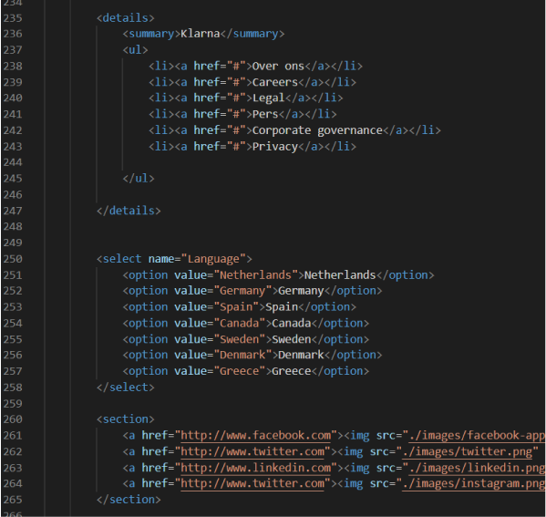
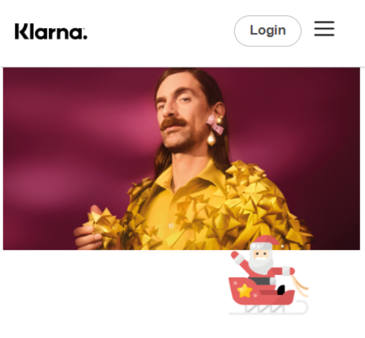

# Procesverslag
Markdown is een simpele manier om HTML te schrijven.  
Markdown cheat cheet: [Hulp bij het schrijven van Markdown](https://github.com/adam-p/markdown-here/wiki/Markdown-Cheatsheet).

Nb. De standaardstructuur en de spartaanse opmaak van de README.md zijn helemaal prima. Het gaat om de inhoud van je procesverslag. Besteedt de tijd voor pracht en praal aan je website.

Nb. Door *open* toe te voegen aan een *details* element kun je deze standaard open zetten. Fijn om dat steeds voor de relevante stuk(ken) te doen.

## Jij

  
uitwerken voor kick-off werkgroep

  ### Auteur:
  Giannina Titahena

  #### Je startniveau:
Blauwe piste
  #### Je focus:
  hier je focus (kies uit responsive óf surface plane)
  Ik wil mijn focus leggen op surface plane.

## Je website

  
uitwerken voor kick-off werkgroep

  ### Je opdracht:
  https://www.klarna.com/nl/?grs=https%3A%2F%2Fwww.klarna.com%2F&grr=empty

  #### Screenshot(s) van de eerste pagina (small screen): 
  Homepagina
  

  #### Screenshot(s) van de tweede pagina (small screen):
  Hoe het werkt pagina
  
 

## Toegankelijkheidstest 1/2 (week 1)

  
uitwerken na test in 1e werkgroep

  ### Bevindingen
  Lijst met je bevindingen die in de test naar voren kwamen:

  #### Screenreader
  Bijna alles is bijna kopniveau 2. Bij veel "kopjes" wordt er geen H meegegegeven      
  waardoor je niet weet wat p tekst is en wat een H is.
  Een link werd overgeslagen. "Zie alle kortingen".

  Afbeeldingen worden niet beschreven, maar er stond alleen bij, bij welk onderdeel het
  hoort.

  Ik zou alt tekst kunnen toevoegen zodat de afbeelding ook wordt beschreven.

  #### Muis en Toetsenbord 
  De states zijn niet volledig uitgewerkt. Je ziet niet wanneer buttons/links etc. zijn 
  geselecteerd.
  In bijvoorbeeld de footer kan ik niet zien wanneer de linkjes geselecteerd zijn.  
  Verder worden de afbeeldingen bij "winkels in de spotlight" geselecteerd,maar weet ik 
  dit niet. Je ziet opeens de afbeeldingen veranderen.

  Ik ga gebruik maken van a om ervoor te zorgen dat je door de linkjes kan selecteren.
  Verder ga ik een focus state maken zodat de gebruiker ziet waar hij zich bevindt.

  #### Motoriek (shocks, elastiekjes)
  Hier korte omschrijving (met indien nodig afbeeldingen)

  Hier een omschrijving van hoe het opgelost kan worden (met indien nodig afbeeldingen)

  #### Visueel (brillen, contrast, kleurenblind, dark/light). 
  Hier korte omschrijving (met indien nodig afbeeldingen)

  Hier een omschrijving van hoe het opgelost kan worden (met indien nodig afbeeldingen)

## Breakdownschets (week 1)

  
uitwerken na afloop 2e werkgroep

  ### de hele pagina: 
  

  ### dynamisch deel (bijv menu): 
  

## Voortgang 1 (week 2)

  
uitwerken voor 1e voortgang

  ### Stand van zaken

  Ik vind het grid onderdeel nog lastig. Echter wil ik dit wel gaan gebruiken voor mijn website.
  Ik weet wel waar ik grid zou willen gebruiken. Zie foto hieronder.

  Ik heb al een deel van mijn html gemaakt. Ik heb ook al geprobeerd wat met css te doen, maar ik vind dit nog wel lastig.
  Ik kan beter eerst focussen op de html en pas later de css gaan doen.
  Verder heb ik de toegankelijkheidstest gemist en zou ik hier nog wat meer over willen vragen. Ik loop dus wel een beetje achter.

  Wat ik wel goed vond gaan is het maken van de breakdownschets. Hierdoor creeër je een duidelijker overzicht voor jezelf. Hier loop ik af en toe al tegen dingen aan. Ik wist o.a. niet goed hoe ik de navigaties moest doen. Ik moest twee navigaties gebruiken. Dit zorgde voor verwarring bij mij.

  ### Agenda voor meeting
  samen met je groepje opstellen

student 1:
 grid- 

Student 2:
 fielset/forum - gebruik maken van icons ipv afbeeldingen (footer)

 Student 3:
 verschillende kleuren - links vormgeven - afbeeldingen knippen

  ### Verslag van meeting
  hier na afloop snel de uitkomsten van de meeting vastleggen

  - Navigatie maken
  - Kijken waar ik wat kan gebruiken. Ik kan op meerdere plekken grid gebruiken.
  - Eerst focussen op html!

## Voortgang 2 (week 3)

  
uitwerken voor 2e voortgang

  ### Stand van zaken

  Grid is uiteindelijk gelukt met behulp van een klasgenoot.
  Ik kwam niet uit met de footer. Ik wist niet welke html code ik moest gebruiken. Uiteindelijk heb ik met behulp van de student assistente de juiste code kunnen vinden. Ik moest hier gebruik maken van details summary. Verder heb ik gebruik gemaakt van select voor de verschillende talen.
  De css van de social media links werkte eerst ook niet.

  
  

  

  ### Agenda voor meeting
  samen met je groepje opstellen

  | student 1      | student 2          | student 3    | student 4        |
  | ---            | ---                | ---          | ---              |
  | dit bespreken  | en dit             | en ik dit    | en dan ik dat    |
  | en dat ook nog | dit als er tijd is | nog een punt | dit wil ik zeker |
  | ...            | ...                | ...          | ...              |

  ### Verslag van meeting
  hier na afloop snel de uitkomsten van de meeting vastleggen

  - Footer code: details summary | gelukt
  - Footer link: display:inline | gelukt
  - select html code | gelukt

## Toegankelijkheidstest 2/2 (week 4)

  
uitwerken na test in 8e werkgroep

  ### Bevindingen
  Lijst met je bevindingen die in de test naar voren kwamen (geef ook aan wat er verbeterd is):

  #### Screenreader
  Hier korte omschrijving (met indien nodig afbeeldingen)

  Hier een omschrijving van hoe het opgelost kan worden (met indien nodig afbeeldingen)

  #### Muis en Toetsenbord 
  Hier korte omschrijving (met indien nodig afbeeldingen)

  Hier een omschrijving van hoe het opgelost kan worden (met indien nodig afbeeldingen)

  #### Motoriek (shocks, elastiekjes)
  Hier korte omschrijving (met indien nodig afbeeldingen)

  Hier een omschrijving van hoe het opgelost kan worden (met indien nodig afbeeldingen)

  #### Visueel (brillen, contrast, kleurenblind, dark/light). 
  Hier korte omschrijving (met indien nodig afbeeldingen)

  Hier een omschrijving van hoe het opgelost kan worden (met indien nodig afbeeldingen)

## Voortgang 3 (week 4)

  
uitwerken voor 3e voortgang

  ### Stand van zaken
  hier dit ging goed & dit was lastig (neem ook screenshots op van delen van je website en code)

Het grootste gedeelt van mijn html css is gelukt alleen loop ik nog tegen een aantal dingen aan. Het stylen van bepaalde a lukten niet. Door middel van de huiswerkopdrachten heb ik geprobeerd het hamburger menu te maken, maar ik liep hier vast.
Ik wil vragen stellen over de JS code aan de hand van het huiswerk en waar het probleem ligt met mijn hamburger menu.

  ### Agenda voor meeting
  samen met je groepje opstellen

  | student 1      | student 2          | student 3    | student 4        |
  | ---            | ---                | ---          | ---              |
  | dit bespreken  | en dit             | en ik dit    | en dan ik dat    |
  | en dat ook nog | dit als er tijd is | nog een punt | dit wil ik zeker |
  | ...            | ...                | ...          | ...              |

  ### Verslag van meeting
  hier na afloop snel de uitkomsten van de meeting vastleggen

  - Hamburger menu is gelukt --> probleem met position
  - Hamburger menu is gelukt --> extra uitleg JS en onderdelen toegevoegd
  - Stylen van een link gelukt (miste inline-block)

## Eindgesprek (week 5)

  
uitwerken voor eindgesprek

  ### Je uitkomst - karakteristiek screenshots:
  
  

  ### Dit ging goed/Heb ik geleerd: 
  Ik heb geleerd animaties te maken. Dit heb ik voorheen nooit eerder gedaan. Verder heb ik geleerd om met zowel css, html als javascript te werken! Bij de andere vakken lag de focus vaak op een onderdeel, maar nu kwam alles samen.

  Ik heb andere html code geleerd zoals summary details.
  Verder heb ik ook geleerd dat veel websites niet gebruiksvriendelijk zijn voor bijvoorbeeld mensen die een motorische beperking hebben. De klarna website kan je niet met de tab toets gebruiken.

  

  ### Dit was lastig/Is niet gelukt:
  Wat niet helemaal is gelukt is de login button werkend maken. Ik had met de     studentassistent besproken dat ik dat als laatste zou doen als ik nog wat tijd zou hebben.
  Verder heb ik ook niet alle buttons in het hamburger menu uitgewerkt.

  Ik had gewerkt met een eigen font die leek op die van klarna. Doordat ik live ging via vScode heb ik geen rekening gehouden dat op andere schermen de tekst er dan anders uit kan komen te zien. Ik heb wel andere fonts meegegeven, maar dat ziet er niet zo mooi uit als op mijn eigen laptop.

  
  
  

## Bronnenlijst

  
continu bijhouden terwijl je werkt

  Nb. Wees specifiek ('css-tricks' als bron is bijv. niet specifiek genoeg).

  1. https://www.youtube.com/watch?v=uCjDIMADK0w&ab_channel=EasyTutorials
  2. https://www.youtube.com/watch?v=5Pp7ke6klBA&ab_channel=ramCoder
  3. https://codepen.io/shooft/pen/GRxXboQ
  4. https://codepen.io/shooft/pen/xxWmbWX
  5. https://codepen.io/shooft/pen/yLKWzqy

